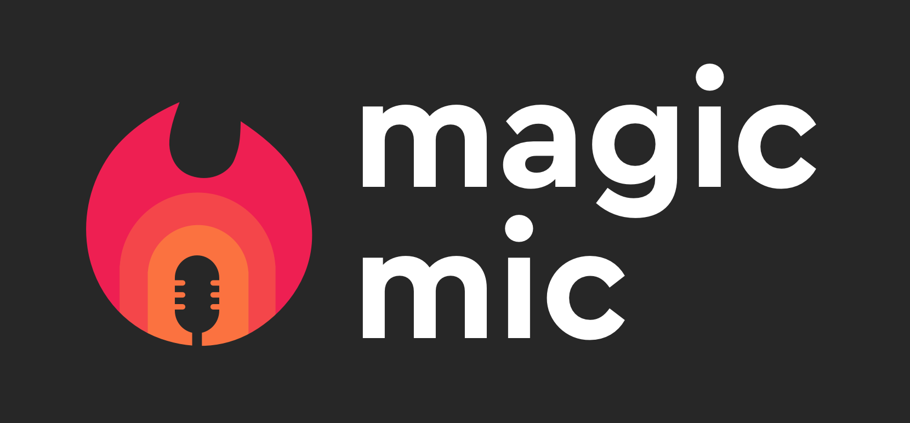

# Magic Mic

*Realtime Audio Processing*



This is the open source component of Magic Mic, an app created by the folks
at [audo.ai](https://audo.ai/) to provide easy access to a realtime version of
our custom machine learning based noise removal tool. Just run the app, switch
the microphone in whatever audio consuming app you are using (zoom, discord,
google meet) to Magic Mic and you're off! This is still in **early** alpha and
so is only available for pulseaudio on linux right now. This is still in active
development and so bug fixes and new features will be coming, along with OS X
and Windows support in the future.

You can get a prebuilt version of magic mic from our [releases](https://github.com/audo-ai/magic-mic/releases).

## Usage
Using Magic Mic should pretty much be as simple as executing the AppImage.
First download the AppImage from our [releases](https://github.com/audo-ai/magic-mic/releases/tag/v0.1.1) then either make it executable in
your file manager or run the following command in the terminal
```sh
chmod a+x /path/to/MagicMic.appimage
```
Then to run the AppImage you can either execute it from your file manager (for example by
double clicking) or from the terminal
```
/path/to/MagicMic.appimage
```
We are still working on a more automated installation.

After executing the AppImage, Magic Mic should open and you should see an icon
in your systray. From the magic mic window you can select your microphone, 
enable and disable denoising, and select your denoising engine. Once that is set up
you can test that everythng is working by clicking on the "Mic Check" button. 
You can feel free to close the Magic Mic window whenever. It will continue
to run in the background. If you did not move the Magic Mic AppImage, you can reopen
the Magic Mic window by clicking on the icon in the systray and selecting "Open".
You can also completely quit all of Magic Mic by clicking on "Quit."

To use Magic Mic in an app that listens to your microphone, all you have to do is
configure the app to use "Magic Mic" as the listening microphone.

We don't have auto update implemeted yet, so please check back here every once in
a while to check out new releases with new features!

## Open Source
Our custom denoising model is proprietary. Only us at Audo can create builds
using it as the denoising engine. If you would like to build Magic Mic yourself,
we support using [rnnoise](https://jmvalin.ca/demo/rnnoise/) as the Audio
Processor.

## Vision
We imagine Magic Mic providing a common interface for realtime audio processing
on many platforms. We want Magic Mic to be an open source tool that enables all
developers to build proprietary or free real time audio processing tools. Right
now, implementing a custom audio processor is just a matter of writing some c++
(we should have a guide soon), but the interface is quite immature and we're
still quite far from realizing this vision, so reach out if you want to help!
Contact us in the github discussions tab or the issues.

## Development
### Structure
This project has esentially 3 components. First, there is the code in
`src-native` which interacts with the audio system and actually creates the
virtual microphone and does the denoising. Then there is the
[tauri](https://tauri.studio/en/) code in `src-tauri` which deals with creating
the system webview and interacting with the frontend code. The naming of these
directories is somewhat misleading, because both the code in `src-native` and
the code in `src-tauri` are compiled to native code. Additionaly, there is
`src-web` which contains a `create-react-app` project which is displayed by
tauri.

### Building with Docker
Run
```sh
DOCKER_BUILDKIT=1 docker build --output . .
```
and the appimage should be copied into your working directory.

### Building without Docker
Run
```sh
mkdir build
cd build
cmake -DVIRTMIC_ENGINE="PIPESOURCE" -DAUDIOPROC_CMAKES="$PWD/../src-native/RNNoiseAP.cmake" ..
make build_tauri
```
This should place an appimage in `src-tauri/target/release/bundle/appimage`.

`PIPESOURCE` is the only virtmic engine available at the moment; in the future
this may change to support other platforms or if we implement other virtual microphones.

### Custom Audio Processors
There is support for building with custom audio processors, and the
documentation will be coming soon. For the meantime you could look at
`src-native/RNNoiseAP.cmake` (and the files it references) as an example. Audio
processors are added to the build by adding there cmake files to the semicolon
seperated list `AUDIOPROC_CMAKES` when configuring the build.
